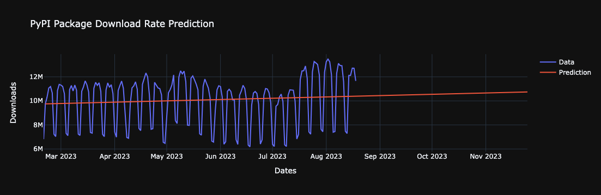

## PyPI Donwload Rate Prediction
With this implementation, you can predict the near future download-rate of your Python packages that are stored on PyPI's servers. Follow the steps on Jupyter Notebook ([example.ipynb](example.ipynb)) and predict your desired packages.

  
Predicting the request's library download rate in the next 100 days:

  

This prediction is based on [MindsDB's PyPI Handler](https://github.com/mindsdb/mindsdb/pull/7026).